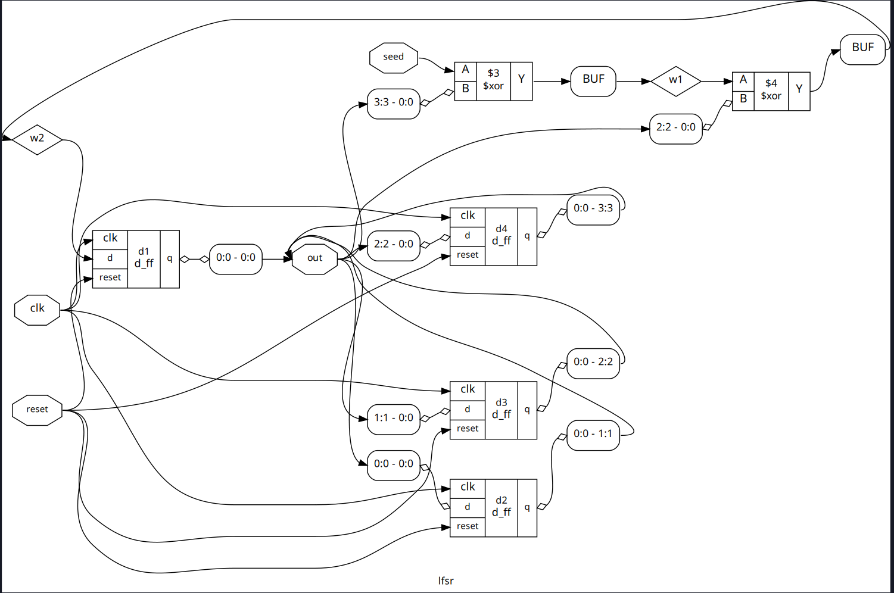
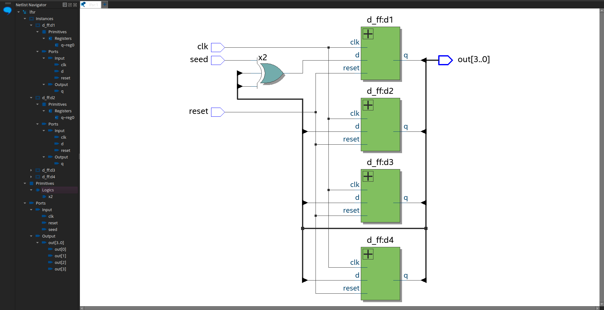

# Linear function shift register

### Description

- Linear function shift register is a shift register that is used to implement a pseudo-random number generator.
- It has d-ff, and xor gates,to implement the lfsr.
- The pattern can be made huge by using more d-ff's in the design.

### Requirements

- Requires python and any verilog simulator,with cocotb package installed.
- Supported verilog simulators: icarus,verilator,modelsim,questa etc.,

``` 
pip3 install cocotb
```
### Test and Verify
You can use any of the simulators available in the market to simulate the parity check.

Run the following shell command to test the parity check:

```
$ iverilog -g2012 -o lfsr.vvp lfsr.v
$ vvp lfsr.vvp
```
This will produce the following output:

```
clk={clock} seed={seed} out={output}
```
- Otherwise make file can be used to test using cocotb in python
- run ```make ``` to run the tests automatically.
- run ```make clean``` to clean the build files.

- The design is synthesizable(lfsr).
- Below is the image of the design after synthesis.




### Applications

- Linear function shift register is used to implement a pseudo-random number generator.
- It can be used in your own applications,for cryptographic purposes,and in the generation of random numbers.
- Even it is not true random,it is a good source of random numbers,for small systems,like embedded systems.

#### Example

```
seed =1
//it should be 1 otherwise the output will be 0 always
parity = parity_check(stream,even)
 0.00ns INFO     running lfsr_tb (1/1)
    15.00ns INFO     clk=0,out=0x1
    25.00ns INFO     clk=0,out=0x3
    35.00ns INFO     clk=0,out=0x7
    45.00ns INFO     clk=0,out=0xe
    55.00ns INFO     clk=0,out=0xd
    65.00ns INFO     clk=0,out=0xb
    75.00ns INFO     clk=0,out=0x6
    85.00ns INFO     clk=0,out=0xc
    95.00ns INFO     clk=0,out=0x9
   105.00ns INFO     clk=0,out=0x2
   115.00ns INFO     clk=0,out=0x5
   125.00ns INFO     clk=0,out=0xa
   135.00ns INFO     clk=0,out=0x4
   145.00ns INFO     clk=0,out=0x8
   155.00ns INFO     clk=0,out=0x0
   165.00ns INFO     clk=0,out=0x1
   175.00ns INFO     clk=0,out=0x3
   185.00ns INFO     clk=0,out=0x7
   195.00ns INFO     clk=0,out=0xe
   205.00ns INFO     clk=0,out=0xd
   215.00ns INFO     clk=0,out=0xb
   225.00ns INFO     clk=0,out=0x6
   235.00ns INFO     clk=0,out=0xc
   245.00ns INFO     clk=0,out=0x9
   255.00ns INFO     clk=0,out=0x2
   265.00ns INFO     clk=0,out=0x5
   275.00ns INFO     clk=0,out=0xa
   285.00ns INFO     clk=0,out=0x4
   295.00ns INFO     clk=0,out=0x8
   305.00ns INFO     clk=0,out=0x0
   315.00ns INFO     clk=0,out=0x1

# As the number of 1s in the stream is even,the parity bit will be 0
```

### License

    GNU General Public License v3.0 (GPLv3)
